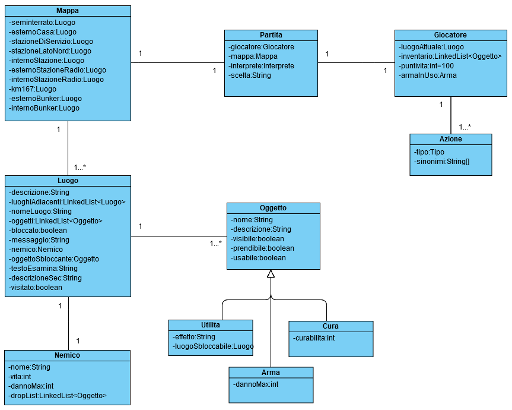
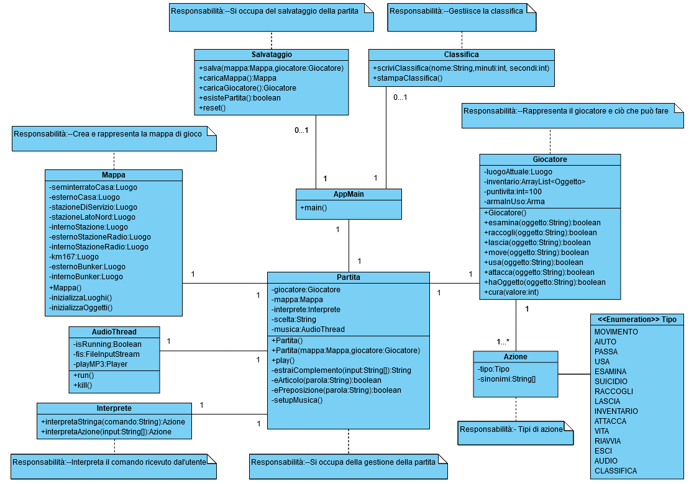
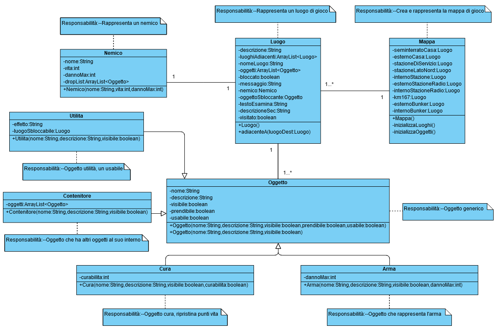
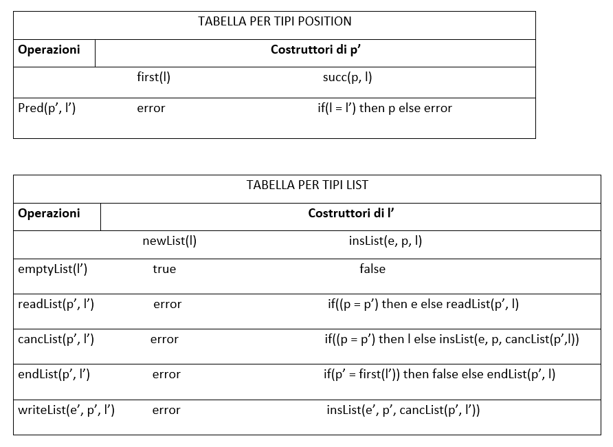
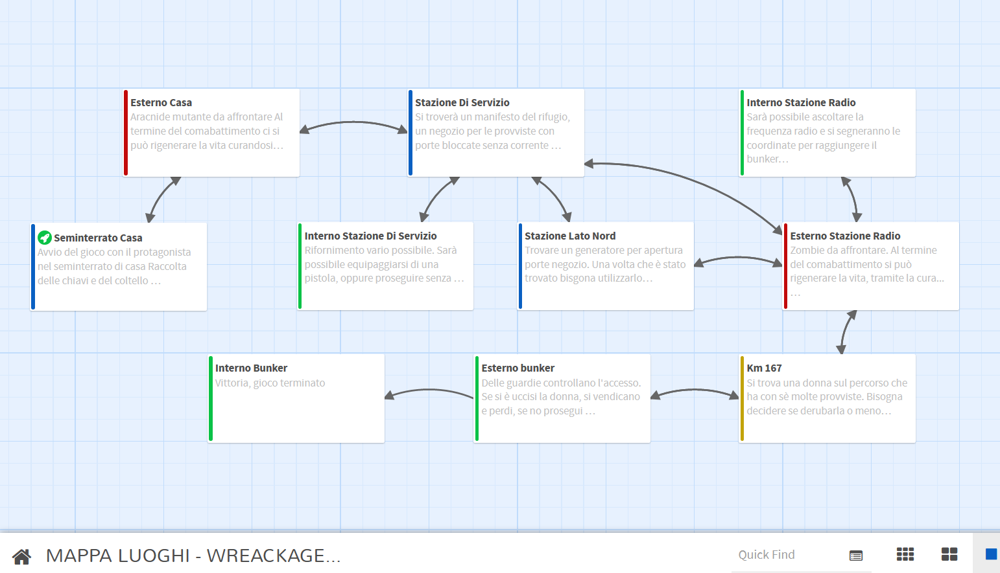

## **RELAZIONE TECNICA FINALE - GOODLUCKHAVEFUN**

## +++ **WRECKAGE** +++

### INDICE

1. [Introduzione](#1-introduzione)
2. [Modello di dominio](#2-modello-di-dominio)
3. [Diagramma delle classi](#3-diagramma-delle-classi)
4. [Dettagli implementativi importanti](#4-dettagli-implementativi-importanti)
5. [Specifica algebrica Lista](#5-specifica-algebrica-lista)
6. [Manuale utente](#6-manuale-utente)

### 1. Introduzione

Il gioco **"WRACKAGE"** dall'inglese "MACERIE", è ambientato in uno scenario post apocalittico, un mondo incerto e pericoloso che è stato fortemente devastato dopo la **guerra nucleare**
tra le due potenze mondiali di Cina e Stati Uniti. Lo scopo principale del giocatore è quello di **trovare il rifugio**
più vicino alla sua posizione e di salvaguardare la propria vita dai nemici geneticamente modificati combattendoli con armi. Il tutto accompagnato da una **traccia musicale** di sottofondo.

All'interno del gioco ci saranno vari luoghi da dover **visitare ed esaminare**, per scoprire oggetti-chiave, armi e informazioni utili al raggiungimento del **bunker di salvataggio**. E'
presente la funzione di salvataggio automatico, in modo da permettere al giocatore di riprendere in un secondo momento da dove si è interrotto.

Se l'utente riesce a concludere il gioco, il suo tempo sarà salvato in un db, contenente la classifica delle partite concluse.

Per una corretta visualizzazione grafica del gioco, il file jar di quest'ultimo è eseguibile tramite **GitBash** o **
Windows Terminal**, app scaricabile direttamente dallo store di windows. Questo è dovuto al fatto che il terminale di default di windows 10 non supporta più nativamente la stampa colorata
ANSI.

Sui dispositivi Apple Macintosh invece è possibile eseguire il file jar anche tramite il terminale standard, senza problemi.

E' stato realizzato tramite l'utlizzo di:

* Linguaggio di programmazione Java;
* Eclipse IDE for Java Developers;
* Apache Maven;
* Visual Paradigm - Modellazione UML;
* Twinery - strumento software per la creazione di narrativa interattiva tramite collegamenti ipertestuali;
* Microsft Teams - Comunicazioni ed organizzaione del lavoro.

             

[Torna all'indice](#indice)

### 2. Modello di dominio

[Torna all'indice](#indice)

### 3. Diagramma delle classi

* Diagramma delle classi - Parte 1:

* Diagramma delle classi - Parte 2:

[Torna all'indice](#indice)

### 4. Dettagli implementativi importanti

* L'avventura ha una trama solida;
* C'è la funzione di salvataggio automatico;
* Sono presenti dei nemici;
* Ci sono delle armi ed oggetti da raccogliere lungo il percorso;
* Ci sono scenari di enigmi, combattimenti e scelte;
* Musica di sottofondo.
* Classifica finale basata su tempi di risoluzione del gioco.

L'utente non è inoltre vincolato ad usare termini specifici per inserire un comando. Ad esempio invece di "vai" potrebbe scrivere anche "sposta", invece di "raccogli" potrebbe scrivere "
prendi" e così via. Per far ciò è stata definita una classe Azione, di tipo enumerativa, contenente i tipi di azioni che si possono eseguire nel gioco. Per ogni azione sono definiti i
termini accettati per riconoscerla e il tipo a cui sono associati. Ad esempio, i termini "sposta" o "vai" sono associati al tipo "MOVIMENTO".

Per la musica invece, si è utilizzato un Thread che viene eseguito quando inizia la partita. E' stata usata una libreria di terze parti(jlayer), in grado di riprodurre file in formato mp3.
La musica è riprodotta all'infinito finchè l'utente non decide di stopparla (ovviamente può nuovamente decidere di rimetterla in un secondo momento) o finchè non termina il gioco.

La lista dei giocatori vincitori viene memorizzata in modo persistente all'interno di un database. In particolare per memorizzare la classifica finale è stato usato il DB H2 in modo da non
aver bisogno di un server separato, ma è incorporato all'interno dell'applicazione. Il database contiene una sola tabella che memorizza per ogni giocatore l'username e il tempo di gioco
totale. Quando un giocatore riesce ad arrivare alla fine viene salvato il suo username e tempo di gioco all'interno del db e viene fatta una query per mostrare la classifica completa
ordinando le righe in base al tempo di gioco in modo crescente. Di conseguenza il giocatore che avrà terminato il gioco in meno tempo comparirà per primo nella classifica finale.

Per verificare la correttezza del codice e del suo funzionamento si è deciso di testare le classi più importanti quali:

* Giocatore
* Luogo
* Salvataggio
* Interprete

I test hanno riportato esito positivo. La versione utilizzata di JUnit è la 4.11.

[Torna all'indice](#indice)

### 5. Specifica algebrica Lista

Una **lista** è una successione di elementi del tipo tipoelem. Ogni elemento ha una posizione all’interno della sequenza.

Sia L = e1, e2, e3, ... en una lista, allora la sua lunghezza è n.

La posizione di un generico elemento ei si indica con pos(i). Ovviamente pos(i) = i ma si preferisce dare un tipo position a sé stante.

#### Specifica sintattica:

sorts: list, tipoelem, boolean, integer

* operations:-newList() -> list
* readList(position,list) ->tipoelem
* writeList(tipoelem, position, list) -> list
* first(list) ->position
* endList(position, list) -> boolean
* succ(position, list) -> position
* pred(position, list) -> position
* insList(item, position, list) -> list
* cancList(position, list) -> list

#### Specifica semantica:

declare l, l’: list; e : tipoelem; p, p’ : position; b: boolean

I costruttori sono due per la lista e due per la posizione:

* **Costruttori di List:** newList(), insList(e, p, l)
* **Costruttori di position:** first(l), succ(p, l)

**Osservazioni:**

* endList(p’, insList(e,p,l)) = if(p’=first(l’)) then false else endList(p’,l). Se p=p’allora si ha false perché abbiamo true solo se p’ = pos(n+1), quindi in posizione p’ non ci devono
  essere elementi.
* writeList(e’ , p’ , insList(e,p,l)) = insList(e’ , p’ , cancList(p’,l’)). La writeList sovrascrive una posizione nella lista, quindi sideve prima cancellare il contenuto in p’ con cancList
  e poi scriverci con writeList.
* readList(p , writeList(e, p , l)) = a. Questa vale se si ipotizza che l non sia vuota (emptyList(l) != true).

[Torna all'indice](#indice)

### 6. Manuale utente

All'avvio il programma verifica se c'è una **partita salvata** o meno. In caso la ricerca dia esito postivo l'utente sceglierà se continuare la stessa o iniziarne una nuova.

Nel caso di nuova partita verrà mostrata una breve **introduzione** e l'utente inizierà il gioco partendo dal seminterrato della propria casa.

Nel caso in cui l'utente scegliesse di riprendere una partita, riprenderebbe dal punto in cui il gioco è stato interrotto.

I comandi eseguibili in ogni momento sono i seguenti:

* **vai** + <nome_luogo> per spostarti
* **esamina luogo** per esaminare il luogo
* **esamina** + <nome_oggetto> per esaminare un oggetto
* **inventario** per visualizzare l'inventario
* **prendi** + <nome_oggetto> per raccogliere un oggetto e aggiungerlo al tuo inventario
* **lascia** + <nome_oggetto> per lasciare un oggetto dell'inventario
* **equipaggia** + <nome_arma> per equipaggiare un'arma dall'inventario
* **usa** + <nome_oggetto> per usare un'oggetto
* **attacca** per attaccare
* **vita** per visualizzare i punti vita
* **suicidio** per suicidarti e terminare il gioco
* **audio** per stoppare / riprendere la musica di gioco
* **classifica** per mostrare la classifica basata sul tempo di risoluzione del gioco
* **restart** per ricominciare una nuova partita
* **exit** per uscire dal gioco con o senza salvataggio

Per ogni **comando** è associata una **azione**, ed ogni azione ha vari **sinonimi** in modo tale che l'utente possa inserire termini secondari a quelli presenti nell'help. Possono essere
inserite all'interno del comando anche preposizioni semplici, preposizioni articolate ed articoli.

Durante il gioco l'utente può decidere di **suicidarsi**. In tal modo avrà perso, eliminato la partita in corso ed uscirà dal gioco.

All'interno del gioco sono presenti **scenari** di:

* Enigmi: Seminterrato Casa, Stazione Di Servizio, Stazione Lato Nord. (MAPPA LUOGHI - COLORE BLU)
* Combattimento: Esterno Casa, Esterno Stazione Radio (MAPPA LUOGHI - COLORE ROSSO)
* Scelta: Km 167 (MAPPA LUOGHI - COLORE GIALLO)
* Racconto: Interno Stazione Di Servizio, Interno Stazione Radio, Esterno Bunker, Interno Bunker (MAPPA LUOGHI - COLORE VERDE)

Il luogo **Km 167** è l'unico scenario in cui il combattimento non è d'obbligo. Durante un combattimento l'utente può infliggere del danno al nemico solo se possiede un'arma e l'ha
equipaggiata. Un combattimento può portare al game over. Fondamentale per il raggiungimento del bunker e quindi per la vittoria è la scelta posta all'utente al luogo km 167.

Non è possibile spostarsi ad un luogo che non è **adiacente** e ad un luogo che non è **sbloccato**. Lo sblocco di alcuni luoghi avviene tramite un oggetto **sbloccante**.

#### Di seguito è riportata la mappa dei luoghi realizzata tramite Twinery.org:

[Torna all'indice](#indice)
